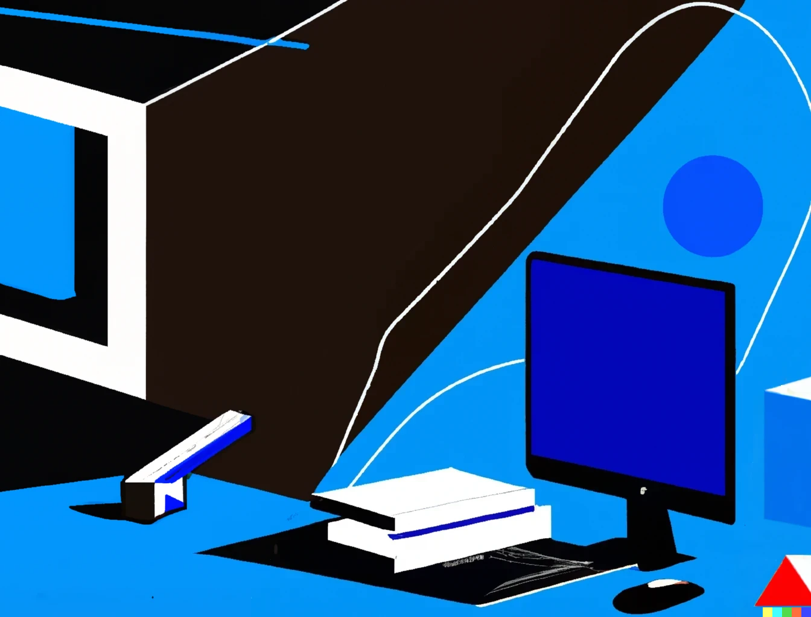

*I was never a great writer.* 

In English class, I would often skim over my friend's essays and imitate their diction in order to get decent grades. Sometimes I would even appropriate a British voice as my inner monologue in attempts to stimulate a more eloquent writing style. These techniques worked fairly well until in class essays became exams, and I would find myself staring at the posters on the wall, wondering if British students received higher marks on their AP Lit exams. Luckily, after graduating from high school, I discovered that essays were not a requirement to work in tech, and so lines of comparative analysis morphed into lines of code. *Now I run a multimillion-dollar biotech startup specializing in stem cell innovation that is backed by some of the largest venture capital firms in the world, and we regularly receive grants from the government due to the crucial nature of our research. To state that I've achieved tremendous success without ever needing to pen another essay would be an understatement of epic proportions. 

As you might have guessed, everything following that asterisk is either a lie at best or a disgraced fantasy that plays out in my head when I can’t sleep. However, I do in fact work in tech, as an IT intern. And I do really enjoy coding. My daily tasks as an IT intern range from network administration to fixing the office printers. Sometimes I even get to clean some laptop screens if I’m lucky. And while I sound ungrateful, I actually quite enjoy my job, so much so that I am also currently studying computer science alongside it. Double the fun. It would be accurate to say that most of my day revolves around computers. 

About a year go, an acquaintance gifted me a book out of the blue. Initially, I kept it around as a kind of hipster accessory. I never planned to read it. Then, on a flight to Amsterdam, inspired by boredom and a small amount of curiosity, I decided to open the book. And while I was holding a rather nondescript graphic novel, I found myself plunged into its pages. This small lapse in my otherwise pretty clear judgement quickly turned into a rekindled love for reading. And following this success, reading has swiftly become one of my favorite pastimes, and takes the edge off my otherwise screen dominant day.

I intended this story to serve as a kind of “mission statement” for this site. I wanted to convey that my love for reading and computers can coexist. Now I’m not sure if it’s such a unique take, however I think the story served its purpose nonetheless. In the same vein as my rediscovery of reading, I wish to take up writing again. And though I may not be a great writer, I truly enjoy the exercise of writing. I am hoping to place my tech endeavors alongside random thoughts and excerpts from my life. An article on which single board computer to buy in brief succession to a 22-year-old’s ramblings on favorite sock colors seems fitting. Whether you're a prospective employer examining my code or simply a fellow sock enthusiast, I extend a warm welcome to my website. I sincerely hope you’ve gained some insight into its purpose and intentions.

*Some sentences in this post have been edited by ChatGPT to account for grammar mistakes and recommend clearer sentence structure*